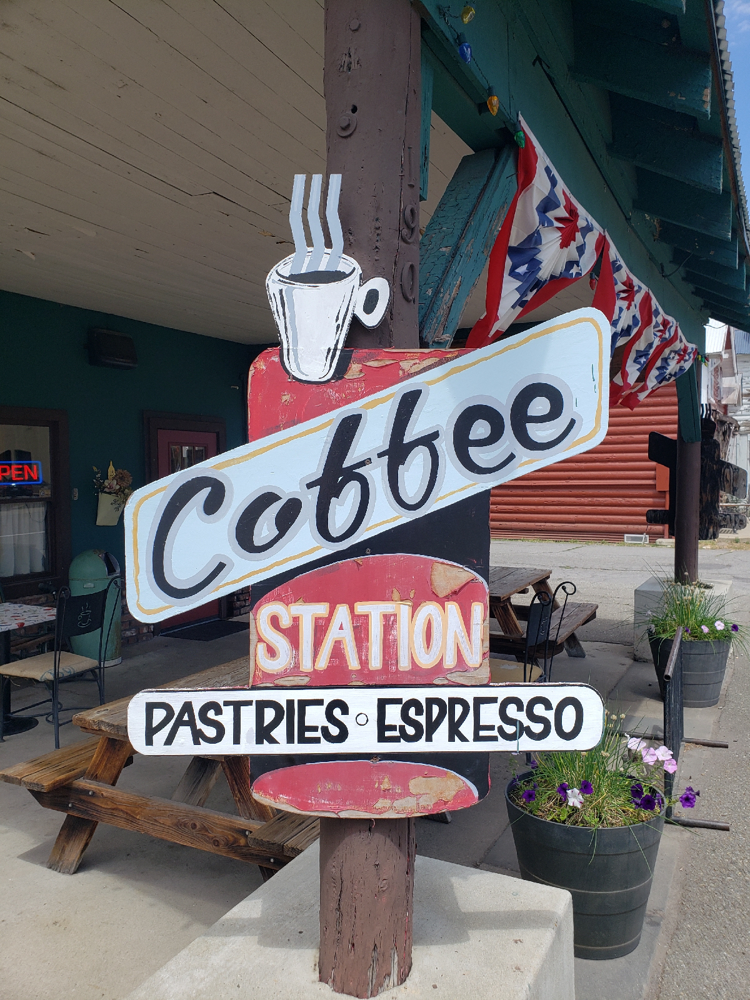
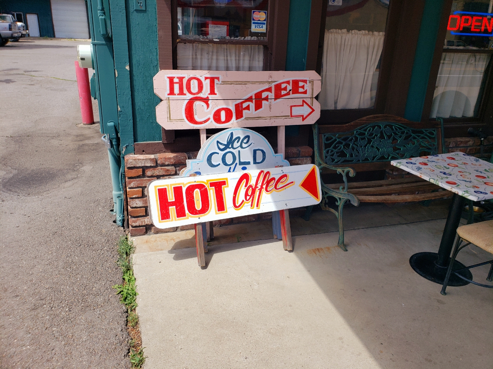
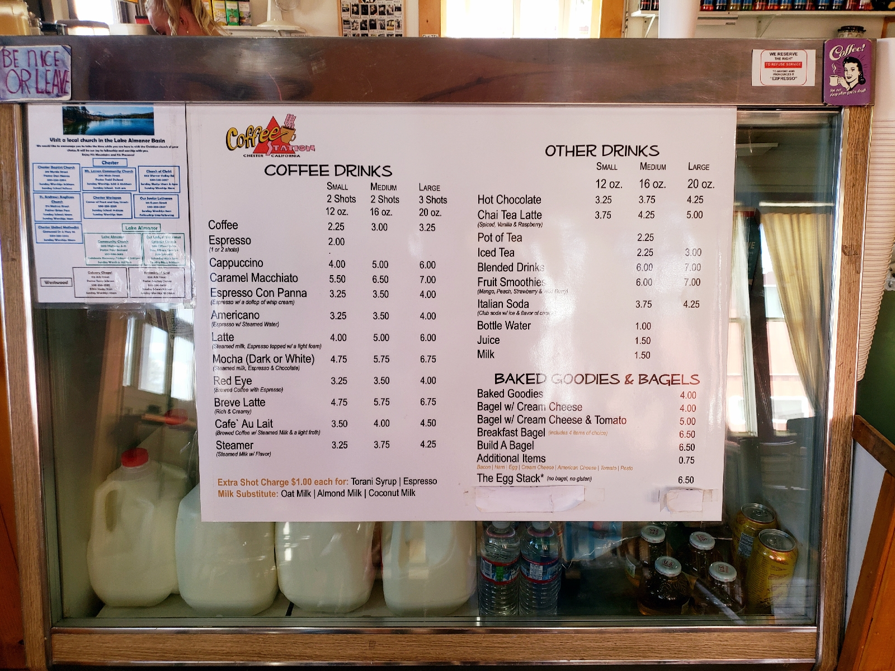
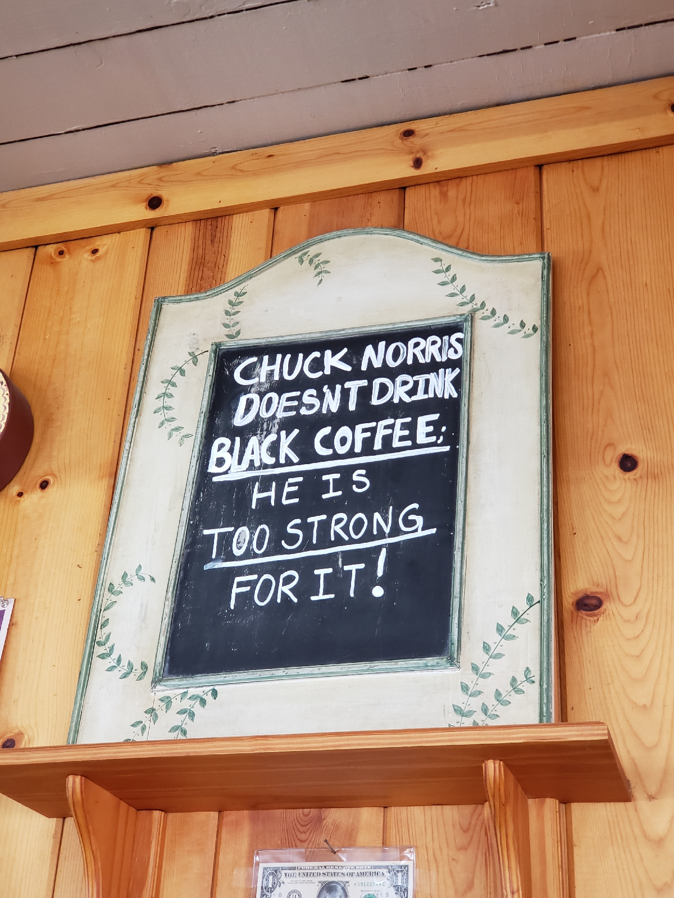
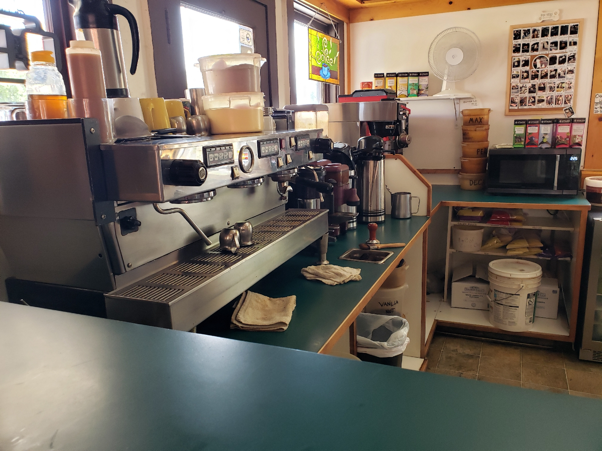
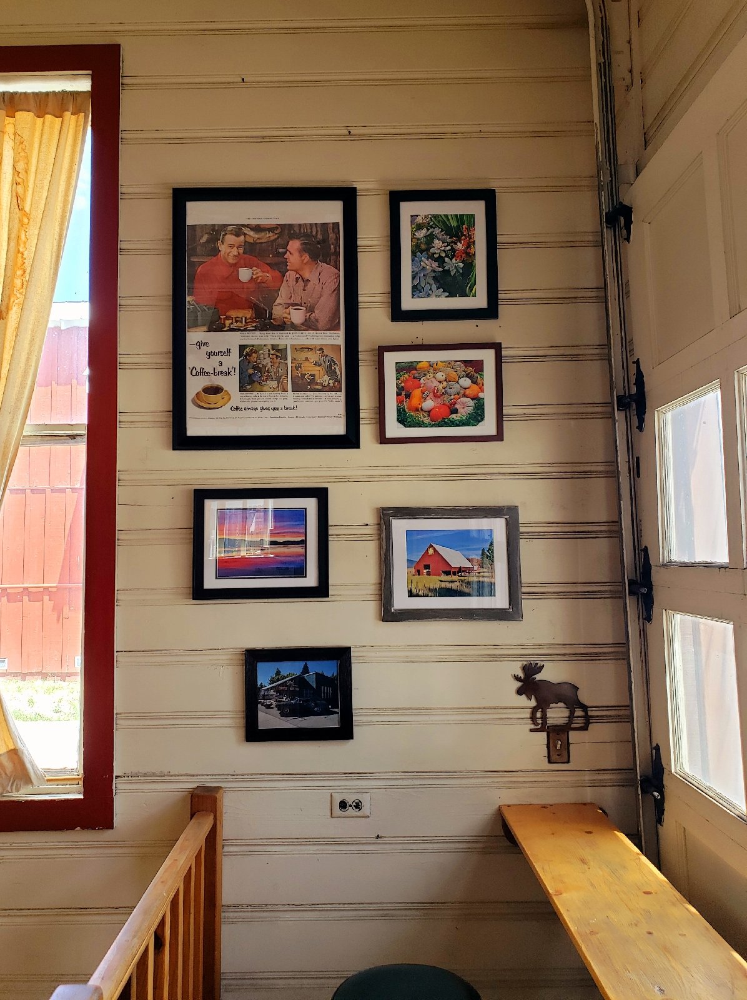

# chester 2.
August 11, 2022

Apparently, this year was different from previous years. 

Difference 1: 

The camp director was not out and about due to having a not-so-slight case of man-eating-bacteria-consuming-his-leg. His day comprised of resting, rebandaging his leg, and keeping his leg raised as much as possible. He was taking presecribed antibiotics in hopes to abate the infection.

Still, his presence was authoritative, like an Anglican Professor X, as he wheel-chaired around giving directions and sage-like wisdom. (That actually fits him well because he is venerable, a principle, and bald.) I wonder what he would be like at his best, probably stomping around like a ship captain telling his crew to everyone to man the deck and batten down the hatches.

We did see him briefly for a brief lecture.

Difference 2:

This year's choir director was also a different person from the previous years. He is a very casual and soft-spoken guy which surprises me. For some reason, whenever I imagine a choir director, I imagine him with a booming voice. (And also with a slight Italian accent.)

I hear he's more lenient and forgiving of a director which I'm grateful for because I've never sung in harmony before.

Difference 3:

Attendance was much smaller this year than previous years. The whole pandemic and local fires from last year made others disinclined to attend this year. So some of the "you got to be there to meet this person and that person" regulars were not present.

---

But different does not necessarily mean better or worse. Since this was my first time attending, I decided to take in the sights with face value. And judging from the first day, I knew that it would be a memorable experience.

---

I decided to not go to the lake today because people were hauling and setting up the sailing boats, which I had no experience doing, and also, I had only 2-hours of recreation time left for the day. 

Rather than join the others, I decided the best use of my time would be to use my free-time elsewhere. So, I decided to go biking and explore the town.

There were a number of places of note during my meanderings: the local bookstore, the local museum, the thift-store, the only fast-food restaurant in Chester (which was a Subway).

One place that particularly interested me was the local coffee shop called "The Coffee Station".

The outside had a small patio with wooden benches and smaller diner seate. Walking in, Billy Jean was playing in the background.  I was the only customer there. I ordered a hot plain latte and looked around at the decorations, knickknacks, and  displayed on the walls.

Looking around, it was clear that the coffee shop had a vintage Americana vibe. Once in a while, other customers entered or ordered through the drive through. But it was not as if there was a large influx of people coming in. I feel that this slow pace is typical throughout the town of Chester, not just in The Coffee Station.

To my surprise, I realized that the music playing was not from a playlist. The cafe was playing from a local radio station! I know that it sounds whatever, but it is usually Spotify or CD on repeat. That is probably not surprising for many of you, but from a regular coffee shop goer in the Silicon Valley Bay Area, most coffee shops stream from FM radio or Spotify.

There is a roll up garage door, but the way the coffee shop is designed, there's no way to fit the car inside. The lounging area of the coffee shop is all atop a raised wooden platform. I wonder if they open up the garage door to clear the air sometimes. I cannot image another use for it.