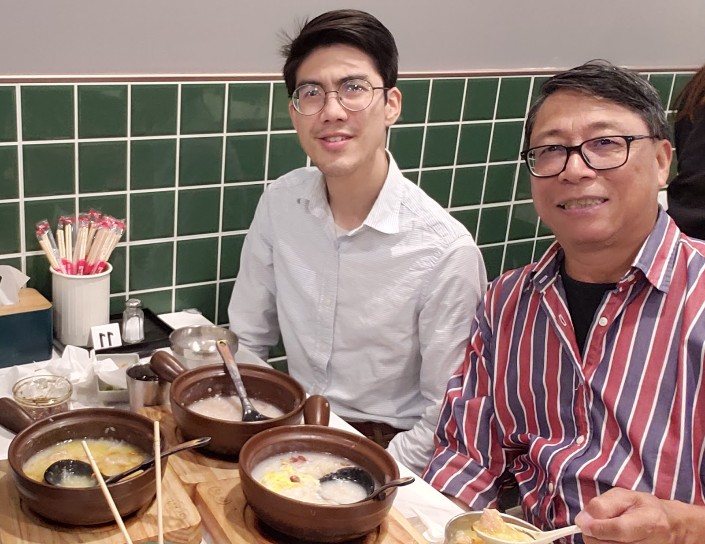

 tuesdays with tc.
August 16, 2022
I've been begun meeting up regularly with TC, my mentor on a weekly phone call. It is fun, and we are beginning to build up steam. This is probably our 5th time meeting every Tuesday. 
Left: LYT Right:TC

I'm not sure what will become of it, but I am hopeful that I can learn from him many things that come from experience. While there is merit from learning from ones mistakes, there is also something invaluable from learning life skills from an elder with more life-experience.
It is not directly inspired by "Tuesdays with Morrie", but many much of his advice parrallels that book. I actually chose Tuesdays to meet with him because of the alliteration—Tuesdays with TC.
