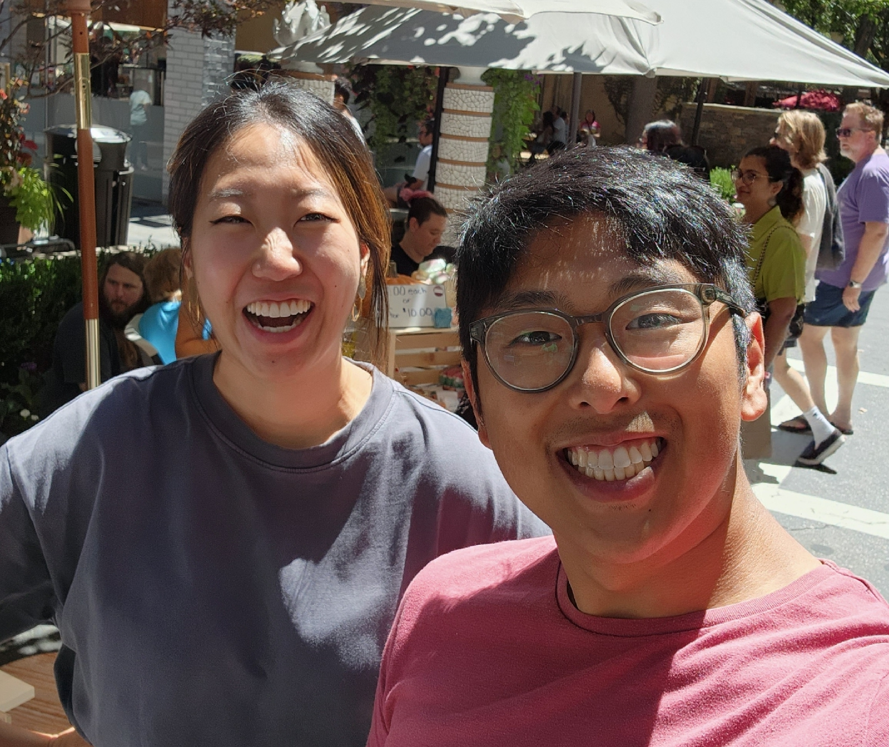

# sj makers market.
August 24, 2022

While trying to learn how to use Instagram, I noticed that one of my friends ML has set up a booth for her potteryware in the upcoming local Makers Market in Santana Row.

Messaged other friends; we all visited and said hi.

To show our support—cause we love you ML—we bought a matcha mixing bowl and a mug. The stoneware is of good quality and knowing that it was made by a friend makes it ever so much more precious and enjoyable.

I miss ML. Time, work, and life makes it difficult to be with friends. It was much easier in college when it would not be a surprise to bump into each other. But now, as friends move away, hustle to make a living, and make families of their own, meeting up with friends is needs to be much more intentional.

