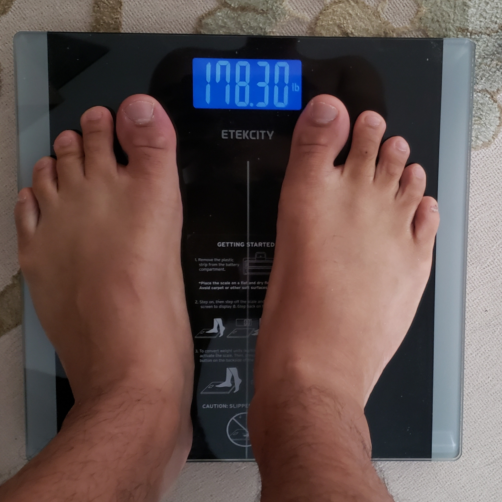
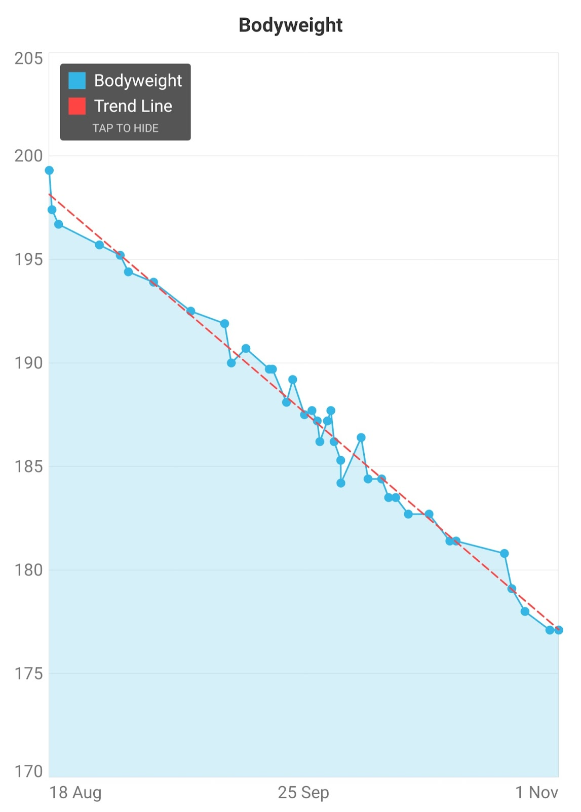

# intermittent fasting.
September 24, 2022

Just weighed myself at 178.4 pounds. I've been intermittent keto OMAD fasting for the past 4 months or so and was stuck in a plateau for about a month and a half, stagnating at around 183lbs. I weigh myself consistently in the morning after drinking a cup of coffee and going to the bathroom.

Last week on a particular stressful day, I did not feel hungry so I skipped dinner. I didn't have food for over 48 hours, and whatever metabolic barrier that resisted weightloss finally broke loose. In the past 2 weeks, I've lost 4 pounds.

I'm excited because I am approaching last year's record of weighing under 175lbs, which according to BMI is normal weight.

I've matured quite a bit in comparison to last year's attempt, and my goal is to lose weight down to 165 and maintain my weight loss for the long term with a bodyfat percentage  below 15%.

I will probably stick with some form of intermittent fasting to lose weight and will surely implement it in my liturgical life. But for weight maintenance... I don't know; perhaps I'll just do CICO.

Here are the surface level benefits that I find from doing intermittent fasting:

1. Subordination of Hunger.
Being hungry sucks, but it is something that I've learned to control. What intermittent fasting taught me was that hunger does not equal malnutrition. Sometimes I am hungry when my body doesn't need food. Now I make better food choices even when I am hungry.

2. Increased attention
I would not say it gives me extra energy, but I do feel like I'm more mono-task oriented and absorbed in whatever task I'm undertaking.

3. Adds free time
All that time to eat and to cook can be now used elsewhere.

4. Easier to Abstain than to limit
It is much easier to say, "I cannot eat right now because I am in my fasting window," rather than, "I am only going to eat a small portion of this really tasty food."

5. Bigger meals
I've always been a big eater, and intermittent fasting allows me to my plate fill with food.

UPDATE (9/24/22): 177.3 lbs! I did do a 2-day fast and reached 175 lbs, but I don't think that counts because my weight rebounded back to 178.7 the next day.
