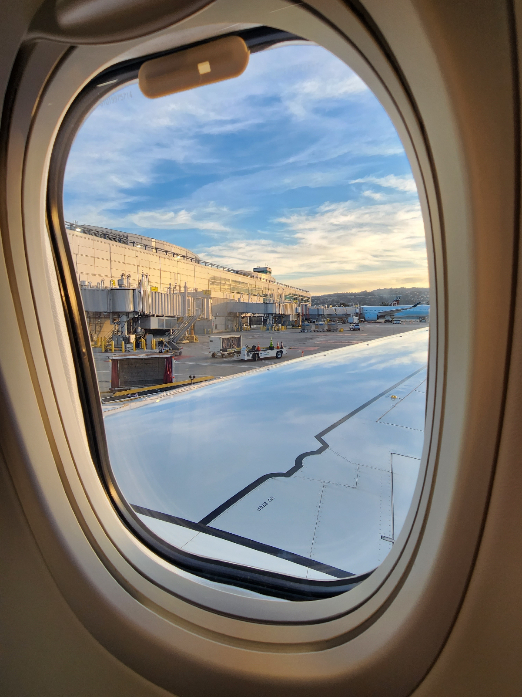

November 19, 2022

trip.
Saturday. flying to Vancouver

In the morning, I drove to the classroom to pick up some gloves, jacket, and a notebook. I also got a haircut. There was a dog that I could hear barking in the back.

Drove to in-laws house. I was sneezing because of the cats, or perhaps it was a delayed allergic reaction from the dog from the haircut place. Taxi pulled up and we stepped in. Pretty quiet on the way there. Nobody talked. I took a nap. I was sneezing a lot probably because of an allergic reaction in the cats.

There's a lot of preparation, not from me but from my in-laws to make sure that going through customs in the international airport was as ease free as possible. 

Watch lady really aggressive. Selling me a $70 watch for $140.  Asked the price, and she brought it to the front counter and said, "let me ring it up. There's a 30 perc discount and even more if you buy two!

I am reading Farmer Boy while waiting for departure:

goodbye Bay Area. See you on Thurs.