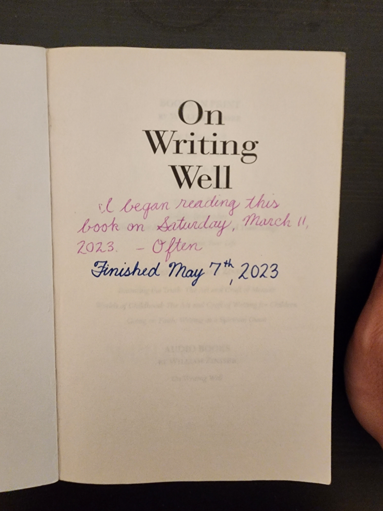

Almost finished reading On Writing Well: The Classic Guide to Writing Nonfiction by William Zinsser. Love it. He seems to be in the same camp as E.B. White—Clear, simple and pleasing sentences; logical, sequential, and narrative-driven articles.

This is one of those books that deserves a reread.

UPDATE: Finished reading the book. Enjoyed it immensely.